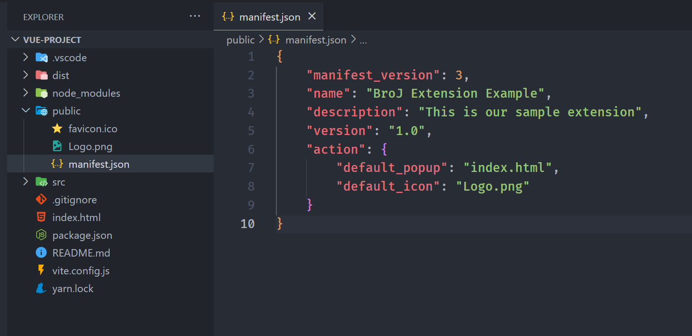
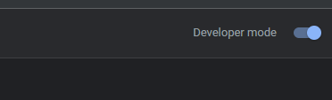
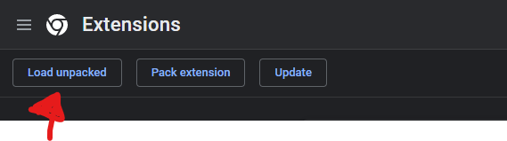
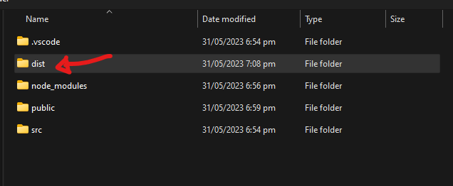
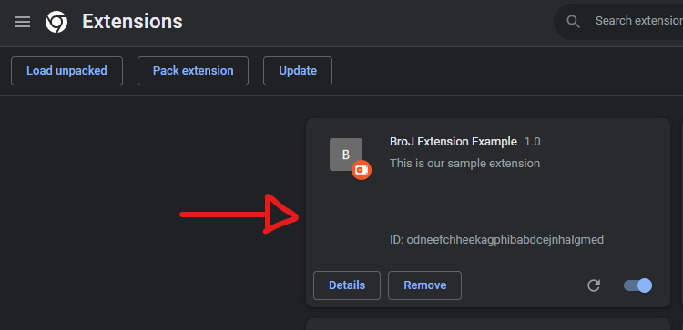
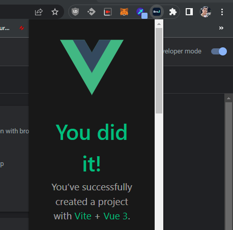

# Create Chrome Extension Using Vue The Easiest Way
* https://www.jenuel.dev/blog/Create-Chrome-Extension-Using-Vue-The-Easiest-Way
* https://github.com/BroJenuel/BroJenuelBlogChromeExtension

# Preparing the latest Node LTS

Useful NVM commands: https://gist.github.com/iotspace/f830c353ba0051627d161c7f26b67e8f

```bash
# list remove available versions of node
$ nvm ls-remote

# install specific version of node
$ nvm install 20.18.0

# set default version of node
$ nvm alias default 20.18.0

# switch version of node
$ nvm use 20.18.0

# list locally installed versions of node
$ nvm list
$ nvm ls

# check node version
$ node -v || node --version
v20.18.0

# check npm version
$ npm -v || npm --version
10.8.2
```

# Create new Vue project

```bash
$ cd chrome-extension-practices
$ npm init vue@latest
Need to install the following packages:
create-vue@3.11.2
Ok to proceed? (y)

> npx
> create-vue


Vue.js - The Progressive JavaScript Framework

RangeError: Incorrect locale information provided

✔ Project name: … vue-easy-extension
✔ Add TypeScript? … No / Yes
✔ Add JSX Support? … No / Yes
✔ Add Vue Router for Single Page Application development? … No / Yes
✔ Add Pinia for state management? … No / Yes
✔ Add Vitest for Unit Testing? … No / Yes
✔ Add an End-to-End Testing Solution? › No
✔ Add ESLint for code quality? … No / Yes
? Add Vue DevTools 7 extension for debugging? (experimental) › No / Yes

Scaffolding project in ~/chrome-extension-practices/vue-easy-extension...

Done. Now run:

  cd vue-easy-extension
  npm install
  npm run dev
```


# Build the project

We can now go to our project by cd `vue-easy-extension` and let us install our packages. 

Install yarn globally:
```bash
sudo npm install -g yarn
```

For me I am going to use `yarn` to install dependences, and then `yarn dev` to run the project.
```bash
$ cd vue-easy-extension
$ yarn && yarn dev

  VITE v5.4.10  ready in 528 ms

  ➜  Local:   http://localhost:5173/
  ➜  Network: use --host to expose
  ➜  press h + enter to show help
```
Now, that our app is working properly


For build commands:
```bash
$ npm build
$ npm run build
$ yarn build
$ yarn run build
```


# Create Extension Manifest file

Create a `manifest.json` inside the `public` folder with this content something like this, also make sure to create/add your `Logo.png` file in the `public` folder. And You can change the content of this` manifest.json` file.

```json
{
    "manifest_version": 3,
    "name": "BroJ Extension Example",
    "description": "This is our sample extension",
    "version": "1.0",
    "action": {
        "default_popup": "index.html",
        "default_icon": "Logo.png"
    }
}
```



You can use this tool for [Chrome extenstion icon generator](https://alexleybourne.github.io/chrome-extension-icon-generator/), then dowload to `public` folder. 

Copy this code into your `manifest.json` file. After putting the `icons` folder into your project. Check more at [Chrome extenstions Manifest - Icons](https://developer.chrome.com/docs/extensions/reference/manifest/icons)
```json
{
    "manifest_version": 3,
    "name": "BroJ Extension Example",
    "description": "This is our sample extension",
    "version": "1.0",
    "action": {
        "default_popup": "index.html",
        "default_icon": {
            "16": "icons/icon16.png",
            "32": "icons/icon32.png",
            "48": "icons/icon48.png",
            "128": "icons/icon128.png"
        }
    },
    "icons": {
        "16": "icons/icon16.png",
        "32": "icons/icon32.png",
        "48": "icons/icon48.png",
        "128": "icons/icon128.png"
    }    
}     
```

You may be wondering what the [difference](https://stackoverflow.com/questions/76872268/what-is-the-difference-between-default-icon-and-icons-in-a-chrome-extention) was between the `"default_icon"` property and `"icons"` property in the `manifest.json` file in Chrome extensions?

* `action.default_icon` is shown in the extension toolbar, next to address bar in the browser. You may show a popup when user clicks the extension icon in toolbar or show quick actions in its context menu. You may also programmatically update it based on certain events or changes in webpage.
* Whereas, the icon specified in `icons` is an identifier for your extension. It will be used in the extension details card on `chrome://extensions` page and also as favicon for the extension pages.


# Build end test the extension

Lets run this command to build.
```bash
$ yarn build
```

Now, open your Chrome browser and go to `chrome://extensions/` and make sure to toggle `developer mode`.




and then click `load unpacked` and select your `dist` folder of your vue project.








Then after adding dist. A new extension will be added that looks like this.




And then you now click pin your extension to show your extension icon. For me I have this icon, so after pinning it I can just open my extension by clicking it.





THAT'S IT! 🙌😁 Now, you can just modify the content you want to show. This is a sample of what I created. 

If you like to publish your extension, you can read how to publish here: https://developer.chrome.com/docs/webstore/publish/.

##### THIS IS THE GENERATED README #####
# vue-easy-extension

This template should help get you started developing with Vue 3 in Vite.

## Recommended IDE Setup

[VSCode](https://code.visualstudio.com/) + [Volar](https://marketplace.visualstudio.com/items?itemName=Vue.volar) (and disable Vetur).

## Customize configuration

See [Vite Configuration Reference](https://vite.dev/config/).

## Project Setup

```sh
npm install
```

### Compile and Hot-Reload for Development

```sh
npm run dev
```

### Compile and Minify for Production

```sh
npm run build
```
